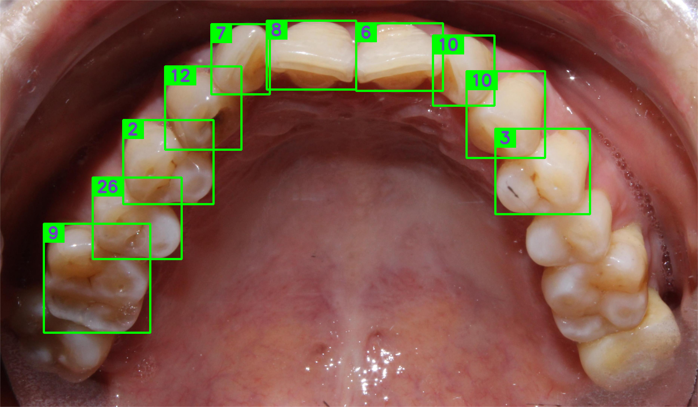

# 服务器路径问题诊断与解决方案

## 问题描述
- ✅ 本地可以打开：`file:///D:/D0_com/workplaceplus/C1_software_report/version2/report.html`
- ✅ Version1可以打开：`http://10.19.125.118:8000/workplaceplus/C1_software_report/version1/report.html`
- ❌ Version2打不开：`http://10.19.125.118:8000/workplaceplus/C1_software_report/version2/report.html`

## 可能的原因分析

### 1. 路径问题
Version2中使用了以下相对路径：
```html
<!-- Logo图片 -->


<!-- 牙齿图片 -->


<!-- result.json -->
fetch(`result.json?t=${timestamp}`)
```

### 2. 中文路径编码问题
路径中的"商标"可能在某些服务器配置下存在编码问题。

### 3. CORS或权限问题
服务器可能对某些文件类型或路径有访问限制。

## 解决方案

### 方案1：检查文件是否存在（推荐先做）
在服务器上确认以下文件存在：
```bash
# SSH到服务器，检查文件
cd /path/to/webroot
ls -la workplaceplus/C1_software_report/version2/report.html
ls -la workplaceplus/C1_software_report/version2/result.json
ls -la workplaceplus/C1_software_report/version2/images/
ls -la 商标/logocombine.png
```

### 方案2：创建符号链接（如果路径问题）
```bash
# 在version2目录下创建到商标目录的符号链接
cd workplaceplus/C1_software_report/version2/
ln -s ../../../商标 logo_images
```

然后修改HTML中的logo路径：
```html

```

### 方案3：复制图片到version2目录（简单直接）
```bash
# 创建logo目录
mkdir -p workplaceplus/C1_software_report/version2/logo

# 复制logo文件
cp 商标/logocombine.png workplaceplus/C1_software_report/version2/logo/
```

然后修改HTML：
```html

```

### 方案4：使用绝对路径（如果服务器支持）
修改HTML中的路径为绝对路径：
```html

```

### 方案5：检查服务器配置
检查你的HTTP服务器配置（如nginx或apache）：

**Nginx配置示例：**
```nginx
location /workplaceplus/ {
    root /path/to/your/webroot;
    charset utf-8;  # 支持中文路径
    autoindex on;
}
```

**Apache配置示例：**
```apache
<Directory "/path/to/your/webroot/workplaceplus">
    Options Indexes FollowSymLinks
    AllowOverride None
    Require all granted
    AddDefaultCharset UTF-8
</Directory>
```

## 诊断步骤

### 1. 浏览器控制台检查
打开 `http://10.19.125.118:8000/workplaceplus/C1_software_report/version2/report.html`

按F12打开开发者工具，查看：
- **Console标签**：看是否有JavaScript错误
- **Network标签**：看哪些资源加载失败（404错误）
- 查看失败的资源URL是什么

### 2. 直接访问资源
尝试直接在浏览器访问：
```
http://10.19.125.118:8000/商标/logocombine.png
http://10.19.125.118:8000/workplaceplus/C1_software_report/version2/images/原始照片_overview.png
http://10.19.125.118:8000/workplaceplus/C1_software_report/version2/result.json
```

### 3. 检查文件权限
```bash
# 确保文件有读取权限
chmod 644 workplaceplus/C1_software_report/version2/report.html
chmod 644 workplaceplus/C1_software_report/version2/result.json
chmod -R 644 workplaceplus/C1_software_report/version2/images/*
chmod 644 商标/logocombine.png
```

### 4. 临时测试方案
创建一个最小测试文件 `test.html`：
```html
<!DOCTYPE html>
<html>
<head>
    <meta charset="utf-8">
    <title>Path Test</title>
</head>
<body>
    <h1>路径测试</h1>
    
    
</body>
</html>
```

如果这个可以打开，说明路径是正确的，问题可能在其他地方。

## 快速修复建议（推荐）

最简单的方法是将所有资源复制到version2目录下：

```bash
# 在服务器上执行
cd /path/to/webroot/workplaceplus/C1_software_report/version2/

# 创建logo目录并复制logo
mkdir -p logo
cp ../../../商标/logocombine.png logo/

# 确保images目录存在且有权限
chmod -R 755 images/
chmod 755 logo/
chmod 644 logo/logocombine.png
```

然后我可以帮你修改HTML文件中的路径。

## 需要提供的信息

为了更好地帮助你，请提供：
1. 浏览器控制台的错误信息（截图或文字）
2. Network标签中失败的资源及其URL
3. 服务器类型（Nginx/Apache/Python SimpleHTTPServer等）
4. 目录结构确认（特别是商标目录的位置）

## 联系支持
如果问题持续，请提供上述诊断信息，我们将进一步协助解决。

